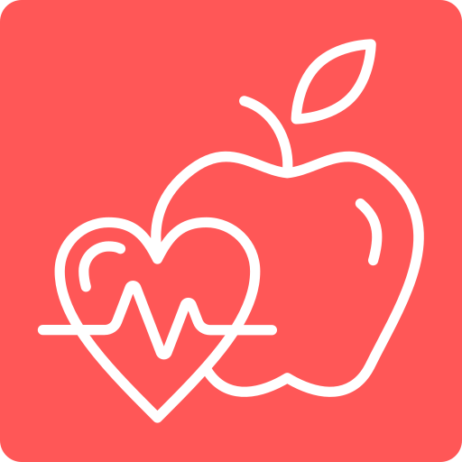

<p align="center">
  
</p>

<h1 align="center">Neutrino</h1>

<p align="center">
  <b>Snap your plate. Log your macros.</b><br>
  Free, open-source, privacy-first food logging for Android.
</p>

<p align="center">
  <a href="https://neutrino.ytosko.dev">Website</a> ·
  <a href="https://neutrino.ytosko.dev/privacy">Privacy</a> ·
  <a href="https://neutrino.ytosko.dev/terms">Terms</a> ·
  <a href="LICENSE">GPL-3.0</a>
</p>

---

Neutrino looks at a photo of your meal with **the AI model you choose**, using your own
Google Gemini or OpenAI API key, and estimates carbohydrates, protein, fat and calories. You review
the numbers, and Neutrino saves them to **Health Connect** as breakfast, lunch, dinner or a snack
based on your local time, so they show up in Google Health, Fitbit and any other app you allow.

**[Download the latest APK](https://github.com/Ytosko/Neutrino/releases/latest)** · Android 9 and newer ·
[how to install](docs/RELEASING.md#installing)

## Principles

- **No servers.** The app talks directly to your AI provider and to Health Connect on your phone.
- **Bring your own key.** You pay your AI provider directly. Keys are encrypted with Android Keystore.
- **No tracking.** No analytics, ads, crash reporting or accounts.
- **Your backups.** Encrypted local backups, plus optional daily/weekly/monthly backups to a
  private app folder in *your* Google Drive.
- **Estimates, not medical advice.** You always review before saving. Neutrino is not a medical device.

## Features

- **Photo → foods:** the AI lists each food with its portion; you review and adjust before saving
- **Food search:** your foods first, ~750 built-in foods (USDA plus a big South Asian list, searchable in Bangla), Open Food Facts for packaged
  products, or AI for anything new
- **Everyday units:** plate, bowl, piece, cup, glass, can as well as g, kg, ml, L
- **Your AI:** Gemini or OpenAI with your own key; pick any vision model your key can use
- **Days:** browse any day, edit past meals, delete with undo, log water
- **Health:** one day, week, month or year at a time (‹ › to step back), 6-hour blocks or hour by hour, goal lines,
  touch-to-read charts, and an estimated A1c (GMI) from 90 days of readings
- **Automatic meal type** from your local time and your own meal times
- **Reminders** for breakfast, lunch and dinner, skipped once that meal is logged
- **AI hints:** your cuisine and short notes to improve recognition
- **Glucose meter:** pair a Bluetooth blood glucose meter (Bluetooth SIG Glucose Profile, e.g. CONTOUR PLUS ELITE);
  readings sync in the background after each test, in mmol/L, with meal marks, a target range, time in range, and the
  meter's clock kept correct
- **Glucose extras:** readings typed in by hand, mg/dL or mmol/L, glucose before and 2 h after each meal, your usual
  change after each food, optional "time to test" reminder, and optional import from CGM apps through Health Connect
- **Medicines and insulin (optional):** your list with MedEx name suggestions, one-tap dose logging, reminders with a
  "Taken" button, and doses in reports; records only, never dose advice
- **Log again:** press and hold a meal to log it again, today or on its own day; **daily goals** for carbs, protein,
  fat, calories and water
- **Widgets and shortcuts:** today's macro rings, one-tap water, a camera button and the latest glucose; plus a small
  latest-glucose widget
- **Reports:** a PDF report for your doctor and a full CSV export, made on the phone
- **Privacy:** optional app lock (fingerprint / screen lock) and hiding from recent apps
- **Languages:** English and Bangla (বাংলা)
- **Health Connect:** writes `NutritionRecord`, `HydrationRecord` and `BloodGlucoseRecord`; reads nothing, except other
  apps' `BloodGlucoseRecord` if you turn on glucose import
- **Backups:** encrypted, automatic on the phone (survives uninstall), optional Google Drive, restore on reinstall

## Repository layout

```
.
├── app/                    # Android app (Kotlin + Jetpack Compose)
├── glucose-ble/            # Bluetooth Glucose Profile protocol, meter sync and a simulated meter (unit-tested)
├── metersim/               # Test-only app that turns a second phone/emulator into a virtual glucose meter
├── wear/                   # Wear OS companion: tile, complications and app (GitHub build only)
├── wear-protocol/          # What the phone and watch send each other (unit-tested)
├── docs/                   # Developer docs (signing, OAuth setup)
├── logos/                  # Brand assets (SVG + PNG variants)
├── web/                    # Website: landing page, privacy policy, terms
│   ├── public/             # Static files served as-is
│   ├── nginx.conf          # Clean URLs, caching, no access logs
│   ├── security-headers.conf
│   └── Dockerfile          # nginx-unprivileged on :8080
└── docker-compose.yml      # Deploys the website (Coolify-ready)
```

## Website

The site is plain HTML/CSS with no build step, no JavaScript, and self-hosted fonts.

**Preview locally**

```bash
cp docker-compose.override.example.yml docker-compose.override.yml
docker compose up --build
# open http://localhost:8080
```

Or without Docker: `python -m http.server 8080 --directory web/public` (clean URLs such as
`/privacy` only work through nginx; use `/privacy.html` here).

**Deploy with Coolify**

1. *New resource → Docker Compose* → select this repository and branch `main`.
2. Set the `web` service domain to `https://neutrino.ytosko.dev:8080`
   (the `:8080` tells Coolify which container port to route to; the public URL stays on 443).
3. Point a DNS `A` record for `neutrino.ytosko.dev` at your Coolify server, then deploy.

## Android app

Kotlin, Jetpack Compose and Material 3. Minimum Android 9 (API 28), targets Android 16 (API 36).
No DI framework, no analytics. Google Play services is used only for optional Drive backup and the
Wear OS companion.

Two flavours: **full** (the GitHub release, with Google Drive backup) and **libre** (no Google
libraries at all, for F-Droid; backups are the encrypted file only).

```bash
./gradlew assembleFullDebug                 # app/build/outputs/apk/full/debug/app-full-debug.apk
./gradlew assembleLibreDebug                # the same without Google Play services
./gradlew :app:testFullDebugUnitTest        # unit tests
```

Open the repository root in Android Studio to run it on a device or emulator.
Wear OS watch app (tile, complications, +250 ml water) and how to install it without Google Play: [docs/WEAR.md](docs/WEAR.md).
Release signing and Google OAuth setup: [docs/SIGNING.md](docs/SIGNING.md). Publishing releases:
[docs/RELEASING.md](docs/RELEASING.md) (push a `v1.2.3` tag; GitHub Actions tests, signs and publishes).

## Glucose meter

Neutrino talks to meters that implement the Bluetooth SIG **Glucose Profile** (service `0x1808`), which the
CONTOUR PLUS ELITE and many other meters do.

- **Pairing:** Settings → Glucose meters → **+** → choose the model (Contour Plus One, Plus Elite or Plus Blue)
  → Pair meter. Android's companion-device picker lists only glucose meters, then the meter shows a PIN to type
  in. Up to 5 meters; each keeps its own sync state. Neutrino connects only to meters you paired.
- **Offline readings:** tests taken away from the phone stay in the meter's memory; the next connection
  downloads everything newer than the last reading Neutrino has.
- **Background sync:** Android wakes Neutrino when the paired meter advertises after a test (companion device
  presence plus a low-power, hardware-filtered background scan), even if the app hasn't been opened for days.
  Only readings newer than the last one are requested.
- **Correct times:** Neutrino reads the meter's clock on every sync. If it's off by more than a minute it sets it
  through the Current Time Service; if the meter refuses, each reading is shifted by the measured offset. Readings
  whose time can't be trusted (clock reset, time fault) are marked and can be fixed by hand.
- **Privacy:** readings stay on the phone, in encrypted backups and in Health Connect. Values are never logged or
  shown in notifications. Needs the "Nearby devices" permission, declared as never used for location.

**Testing without a meter:** install `metersim` on a second phone or emulator (`./gradlew :metersim:installDebug`).
It advertises as a CONTOUR PLUS ELITE, pairs with a PIN, stores readings, and lets you take tests with meal marks,
HI/LO, control solution and strip errors, skew or reset its clock, and make the clock read-only. Two emulators
see each other over the emulator's virtual Bluetooth. The protocol and sync logic are also covered by unit tests
in `glucose-ble` against a simulated meter.

## Backups

Setup ends with a required backup; Google Drive is optional (**Settings → Backup**).

- **Contents:** AI settings and API keys, meals with their photo thumbnails, water and the personal food directory,
  packed into one `.nbk` file ([format](app/src/main/java/dev/ytosko/neutrino/data/backup/BackupCrypto.kt)).
- **Encryption:** AES-256-GCM with a random backup key. The key is wrapped with the user's password
  (PBKDF2-HMAC-SHA256), so scheduled backups run without asking and only a restore needs the password.
- **Phone:** written automatically to a fixed file in a hidden folder in shared storage, so it survives uninstalling
  and a new install finds it without a file picker. This needs "All files access" (Android 11+) or the storage
  permission (Android 9–10); the app touches nothing else. Refreshed daily and shortly after meals change (WorkManager).
- **Google Drive:** the hidden app folder, `drive.appdata` scope only, via Google Play services authorization and
  the Drive REST API. Daily, weekly or monthly; each upload replaces the previous file.
- **Restore:** *Welcome → Restore it*: checks this phone and the Google accounts you pick, lists what it finds
  (newest marked *Latest*) and restores the chosen backup with its password.

Drive backup only works in builds signed with a certificate registered for the OAuth client, so forks need their
own Google Cloud OAuth client ([docs/SIGNING.md](docs/SIGNING.md)). The backup file works everywhere.

## Food data

Search is designed so most logging works offline and gets faster the more you use it:

1. **Your foods**, everything you've logged, ranked by how often, how recently and at which meal you eat it.
2. **Built-in foods** in [`app/src/main/assets/foods.json`](app/src/main/assets/foods.json) (about 200 items):
   - generic foods from **USDA FoodData Central, SR Legacy** (public domain), and
   - common **Bangladeshi and South Asian dishes** with household units (plate, bowl, piece). These values are
     approximate estimates; corrections with sources are very welcome.
3. **Packaged products** from [Open Food Facts](https://world.openfoodfacts.org) (online; data under the
   [ODbL](https://opendatacommons.org/licenses/odbl/1-0/)).
4. **New foods**: anything else is estimated once by your AI provider from its name and saved to your foods.

The built-in list is generated from [`tools/fooddb/foods_spec.py`](tools/fooddb/foods_spec.py):

```bash
python tools/fooddb/build_foods.py path/to/FoodData_Central_sr_legacy_food_csv_2018-04.zip
```

## Brand

Primary colour `#FF5757`. Font: [Plus Jakarta Sans](https://github.com/tokotype/PlusJakartaSans) (OFL).
Logo files live in [`logos/`](logos):

| File | Use |
|---|---|
| `logo.svg` / `logo.png` / `logo-1024.png` | App icon tile (rounded square) |
| `logo-square.svg` | Full-bleed square (Android adaptive / maskable icons) |
| `logo-round.svg` / `logo-round.png` | Circular avatar (GitHub, social) |
| `logo-mark.svg` | Coral mark on transparent |
| `logo-mark-white.svg` / `logo-mark-dark.svg` | Mono marks for dark / light backgrounds |

The GPL-3.0 covers the code, not the Neutrino name and logo. Forks are welcome under a different
name and icon.

## Contributing

Issues and pull requests are welcome. Contribution guidelines will land with the Android app.
For security issues, see [SECURITY.md](SECURITY.md).

## License

Neutrino is licensed under the [GNU General Public License v3.0](LICENSE).
Icons are from [Lucide](https://lucide.dev) (ISC). Food data: USDA FoodData Central (public domain) and
Open Food Facts (ODbL).

Health Connect, Google Health, Fitbit and Gemini are trademarks of Google LLC. OpenAI is a
trademark of OpenAI. Neutrino is not affiliated with or endorsed by either.
